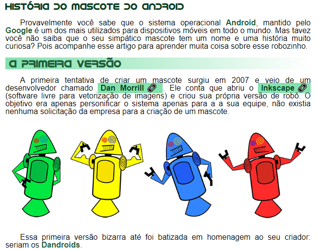
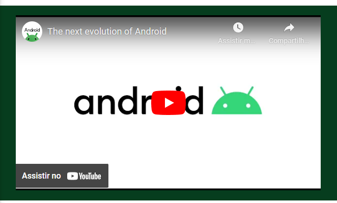
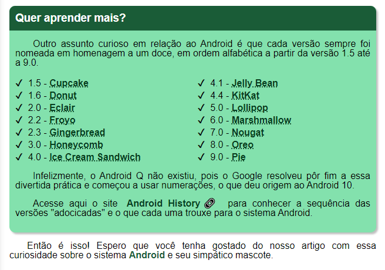

# Android - Curso em Video
Challenge n°10

## Content
* [Overview](#overview) 
     * [The Challenge](#the-challenge)
* [My Process](#my-process)
     * [Technologies](#technologies)
     * [What I learned](#what-i-learned)
     * [Final Project](#final-project)
* [Author](#author)

## Overview

It was a great experience working on this project...a full complete website using everything that I learned in previous classes. A Full semantic project using planned tags and classes to identify and organize them better. Through Professor Guanabara's teaching, I achieved this final project from module 2.

### The Challenge

The project was divided in one header, three sections and one footer:
- I had to make a full responsive website to each screen size;
- CSS variables;
- Emojis.

## My Process

- My initial thought was to classify each tag in android.html content in order to make the style easier and more organized...but I was about to understand how wrong I was.
    - started classifying each tag with an "order name", for example: `
`...
    - When I realized how massively repetitive it was, I adopted other technic; 
- header:
    - It has a `h1`, `p` and `nav` tag;
    - Nav has some `a` tags with no path linked;
- main:
    - Three sections tag;
        - section one contains almost every text content in the webpage;
        - section two has the `iframe`;
        - section three is all about "learning more";
- footer
    - some author credits;

### Technologies
- HTML5 (semantics)
- CSS3 (Variables)
- [Emojis](https://emojipedia.org/)

### What I learned
I learned how well planned a full website need to be;

### Final Project

## Author
- LinkedIn - [Vinicius Duarte](https://www.linkedin.com/analytics/post-summary/urn:li:activity:7143273780763688960/)
- Intagram - [@vinicius_duartesd](https://www.instagram.com/vinicius_duartesd/)